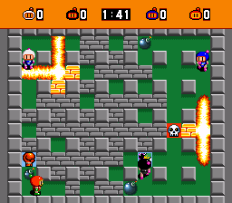

**BOMBERMAN**# Bomberman en JavaScript

## Description
Ce projet est une version simplifiée du jeu classique Bomberman développée en JavaScript. Le jeu consiste à naviguer à travers un labyrinthe, placer des bombes pour détruire les obstacles et éliminer les ennemis tout en évitant de se faire toucher par les explosions.

## Fonctionnalités
- Déplacement du personnage avec les touches directionnelles (haut, bas, gauche, droite).
- Placement de bombes avec la touche espace.
- Mettre en pause le jeu grace à la touch 'p' du clavier.
- Gestion des collisions et des règles du jeu.

## Comment jouer
1. Cloner ce dépôt sur votre machine locale.
2. Ouvrir le dossier sur vscode et lancer le live-server
3. Utiliser les touches directionnelles pour déplacer le personnage.
4. Appuyer sur la touche 'space' pour placer une bombe.

## Captures d'écran

## Dépendances
Ce projet ne nécessite aucune dépendance externe. Il utilise uniquement JavaScript, HTML et CSS.

## Contribution
Les contributions sont les bienvenues ! N'hésitez pas à soumettre des suggestions, des rapports de bogues ou des demandes de fonctionnalités via les issues GitHub.

---

**Auteur :** 
[mamadbah2](lien_vers_profil_github)
[belhajs](lien_vers_profil_github)
